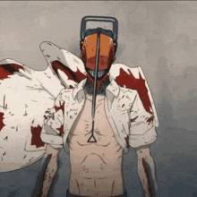
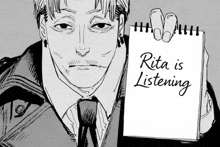

<div align="center">

  <!-- Header Banner -->
  

  <!-- Live Anime Hero Showcase (Chainsaw Man x Zero Two) -->
  <p align="center">
    
    &nbsp;&nbsp;&nbsp;&nbsp;&nbsp;&nbsp;
    
  </p>

  <!-- Animated Typing Headline -->
  <a href="https://github.com/Raghansh">
    
  </a>

  <br/><br/>

  <p align="center">
    <a href="https://github.com/Raghansh?tab=followers"></a>
    <a href="https://www.kali.org/"></a>
    <a href="https://archlinux.org/"></a>
    <a href="https://github.com/Raghansh"></a>
  </p>

</div>

---

### 🚀 About Me

<table>
  <tr>
    <td width="64%" valign="top">

```zsh
raghansh@kali-arch:~$ neofetch --profile
```

```yaml
Name:         Raghansh Gulati
Location:     India 🇮🇳
Role:         Ethical Hacker & Full-Stack Engineer
OS (Security):Kali Linux 🐉 (Offensive Security & PenTesting)
OS (Dev):     Arch Linux 🍙 (Minimalist Dark Rice)
Theme:        Tokyo Night × Cyberpunk
Anime:        Darling in the Franxx (Zero Two) & Chainsaw Man 🩸
Philosophy:   "If you don't take risks, you can't create a future."
```

- 🛡️ **Cybersecurity Enthusiast**: Vulnerability assessment, penetration testing, malware analysis & defensive auditing.
- 🐉 **Kali Linux Expert**: Network reconnaissance, exploit tooling, Wireshark, Nmap, Metasploit, and custom bash scripts.
- 🍙 **Arch Linux Power User**: Highly optimized Linux workflow for deep development & automation.
- 💻 **Modern Web Crafting**: Building fast, reactive, scalable web apps with **Next.js**, **React**, and **Tailwind CSS**.
- 🐍 **Security Automation**: Crafting vulnerability scanners, reconnaissance bots, and backend APIs in **Python**.
- ☁️ **Cloud Infrastructure**: Deploying edge workers and web security gateways with **Cloudflare**.

    </td>
    <td width="36%" align="center" valign="middle">
      
      <br/><br/>
      <sub><i>⚡ "In our world, knowledge is the ultimate weapon."</i></sub>
      <br/><br/>
      
    </td>
  </tr>
</table>

---

### ⚔️ Anime Favourites & Aesthetics

<div align="center">

| **🌸 Darling in the Franxx** | **🪚 Chainsaw Man** |
| :---: | :---: |
| *"You're my darling, after all!"* — **Zero Two** | *"I'll keep fighting, no matter what it takes."* — **Denji** |
|  |  |

</div>

---

### 🛠️ Tech Stack & Arsenal

<div align="center">

#### 🛡️ Cybersecurity & Operating Systems


#### 🌐 Web & Frontend Development


#### ⚙️ Backend, Cloud & DevOps


</div>


<br/>

<div align="center">
  
</div>
